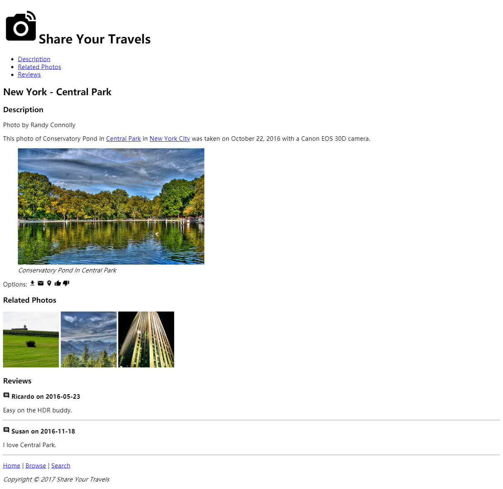
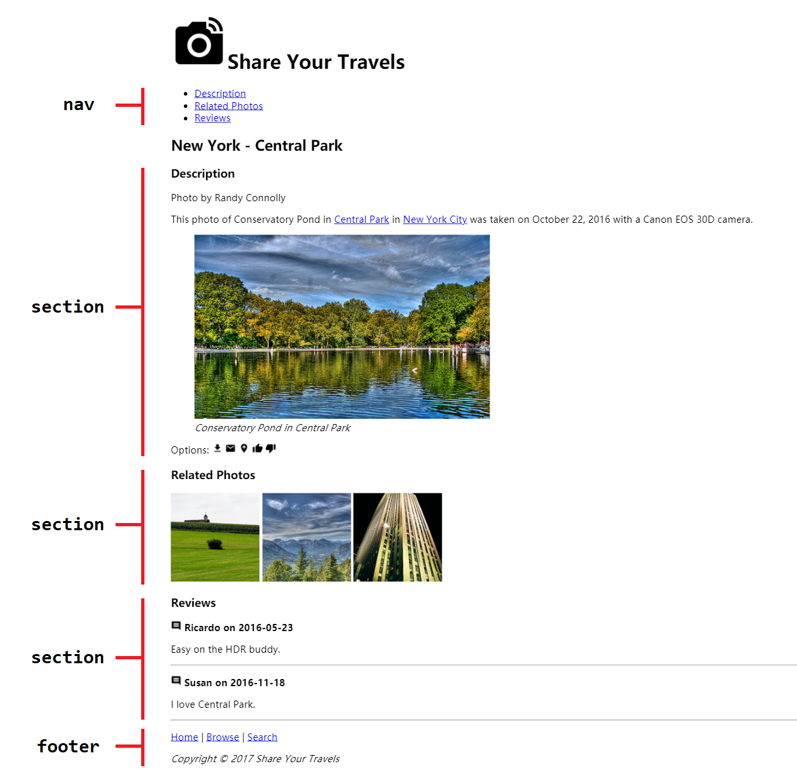

# Lab02 - HTML

## 简介

本次 Lab 主要涉及 HTML 的基础知识，以及 HTML5 中新提出来的语义化标签

## 要求

请补充 `Lab02.html` 中的相应代码，使得补充后的页面效果与以下效果相同

推荐在编写代码过程中使用 `<article>`、`<nav>`、`<footer>` 等 HTML5 语义化标签来代替像 `
` 这样的通用 HTML 标签。

需要注意的是一些语义化标签如 `<section>` 或 `<figure>` 可能需要继续包含其它标签作为子节点

具体可以参考下图：

## 注意

1. 本次 Lab 主要考察 HTML 语法，禁止使用任何 CSS
2. 为考察对 HTML5 标签的使用，限定 `
` 标签数量不大于 5，需要用到该标签的情况请思考如何使用 HTML5 标签实现
3. 页面中共有八处超链接，为方便起见请全部定位到 `#`
4. 特殊符号如 `©`， 请使用字符实体实现
5. 分割符请使用 `|` 而不是 `丨`（gun）或 `|丨丨།│ Ι` 等其它奇怪分隔符，具体原因参考此链接：[有哪些让你目瞪口呆的 bug？](https://www.zhihu.com/question/21747929/answer/319675621)

## 参考

1. Fundamentals of Web Development. Chapter 3.
2. [HTML 字符实体](http://www.w3school.com.cn/html/html_entities.asp)
3. [HTML5 标签](http://www.w3school.com.cn/html5/html5_reference.asp)

## 测试

本次 Lab 没有唯一答案，只要求最后效果与效果图类似，并使用了要求的语义化标签即可。所有测试基于 Chrome 进行。

## 提交

请直接将你的代码目录 push 到 GitHub，无需压缩成 zip 或 rar

## 截止日期

**2018-3-27 23:59:59 GMT+08 (中国标准时间)**

逾期扣除该 Lab 总分的 **20%** 分数直至 **0**

## Lab 相关

有任何疑问欢迎联系助教：

> Email:
>
> [王婕](mailto:veronicadavichi@outlook.com)
>
> [杨森](mailto:syang15@fudan.edu.cn)
>
> [花楠](mailto:15302010013@fudan.edu.cn)
>
> Or 微信群上戳一戳
