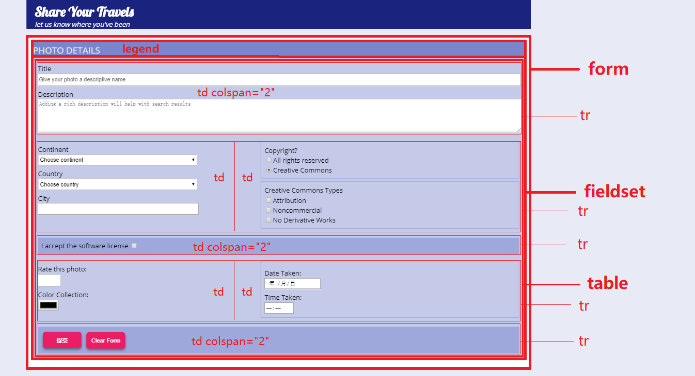
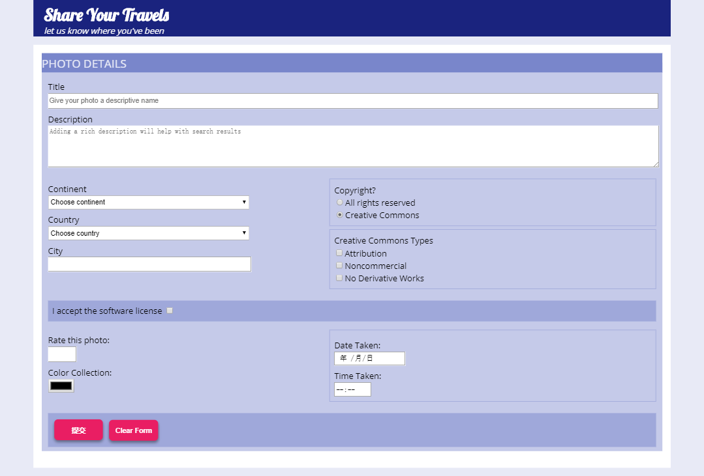

# Lab04 - HMTL Form / Table

## 简介

本次 Lab 主要涉及 HTML 的表单和表格知识

## 要求

1. 本次 lab 不要求 css 的编写，我们已经在 `css` 文件夹中提供了必须的 css 文件，你可以根据你的需要决定是否修改该文件
2. 表单中的 `method` 属性值为 `post`，`action` 属性值为 `http://www.randyconnolly.com/tests/process.php`
3. 表格布局建议参照如下布局图:

提供参考的最终效果图如下：

## 参考

1. Fundamentals of Web Development. Chapter 5.
2. [HTML form](http://www.w3school.com.cn/tags/tag_form.asp)
3. [HTML table](http://www.w3school.com.cn/tags/tag_table.asp)

## 测试

本次 Lab 没有唯一答案，只要求最后效果与效果图类似，并在 Lab 中使用了 `form` 以及 `table`

## 素材

本次 Lab 素材已放到课程对应的 Lab 仓库上

关于同步的问题，请参考同步教程 [Github进行fork后如何与原仓库同步](https://blog.csdn.net/chenyufeng1991/article/details/49276855)

## 提交

本次 Lab 请提交到 github 已有的 Lab 仓库上，无需额外创建新的 Lab 仓库，仓库的结构请参考如下：

* `[Your GitHub Repo]`
    * `css` css folder
    * `images` images folder
    * `Lab04.html` lab html
    * `xxx.xxx` other files

## 截止日期

**2018-04-10 23:59:59 GMT+08 (中国标准时间)**

## Lab 相关

有任何疑问欢迎联系助教：

> Email:
>
> [王婕](mailto:veronicadavichi@outlook.com)
>
> [杨森](mailto:syang15@fudan.edu.cn)
>
> [花楠](mailto:15302010013@fudan.edu.cn)
>
> Or 微信群上戳一戳
