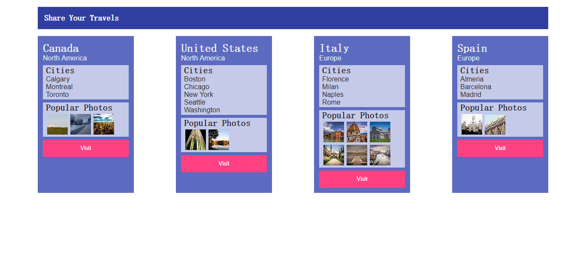

# Lab06 - JavaScript

## 简介

本次 Lab 主要涉及 JavaScript 的基础使用

## 要求

1. 本次 lab 不要求 css 和 html 的编写，我们已经提供了除 js 文件外的其它所有文件，但你可以根据你的需要决定是否修改这些文件
2. 禁止使用直接编写 html 的方式完成本 lab，`

` 内的内容必须由 js 代码动态生成 
3. 我们已经在 `js/data.js` 中提供了本次 lab 所有的必需数据，请直接使用
4. 如无必要，请全部使用 `const` \\ `let` 声明变量 && 具体原因建议阅读 [Understanding ECMAScript 6 - 01-Block-Bindings](https://github.com/nzakas/understandinges6/blob/master/manuscript/01-Block-Bindings.md)

提供参考的最终效果图如下：

## 参考

1. Fundamentals of Web Development. Chapter 8.
2. [Javascript MDN web docs](https://developer.mozilla.org/zh-CN/docs/Web/JavaScript)

## 测试

本次 Lab 没有唯一答案，只要求最后效果与效果图类似即可

## 素材

本次 Lab 素材已放到课程对应的 Lab 仓库上

关于同步的问题，请参考同步教程 [Github进行fork后如何与原仓库同步](https://blog.csdn.net/chenyufeng1991/article/details/49276855)

## 更多

Docs 仓库上更新了 nodejs 的相应文档 [自由而没用的 nodejs 起步指南](https://github.com/fudansswebfundamental/Docs/blob/master/%E8%87%AA%E7%94%B1%E8%80%8C%E6%B2%A1%E7%94%A8%E7%9A%84%20nodejs%20%E8%B5%B7%E6%AD%A5%E6%8C%87%E5%8D%97.md)，欢迎大家入坑（逃

这部分只是建议大家尝试，但我们并不会进行检查

## 提交

本次 Lab 请提交到 github 已有的 Lab 仓库上，无需额外创建新的 Lab 仓库，仓库的结构请参考如下：

* `[Your GitHub Repo]`
    * `css` css folder
    * `images` images folder
    * `js` javascript folder
    * `Lab06.html` lab html
    * `xxx.xxx` other files

## 截止日期

**2018-05-08 23:59:59 GMT+08 (中国标准时间)**

## Lab 相关

有任何疑问欢迎联系助教：

> Email:
>
> [王婕](mailto:veronicadavichi@outlook.com)
>
> [杨森](mailto:syang15@fudan.edu.cn)
>
> [花楠](mailto:15302010013@fudan.edu.cn)
>
> Or 微信群上戳一戳
